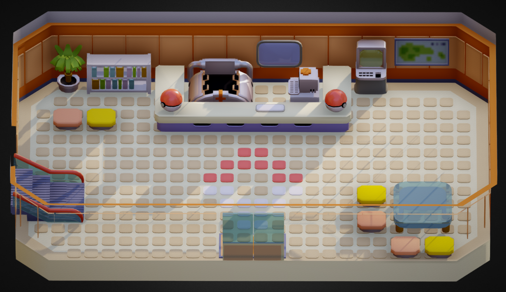
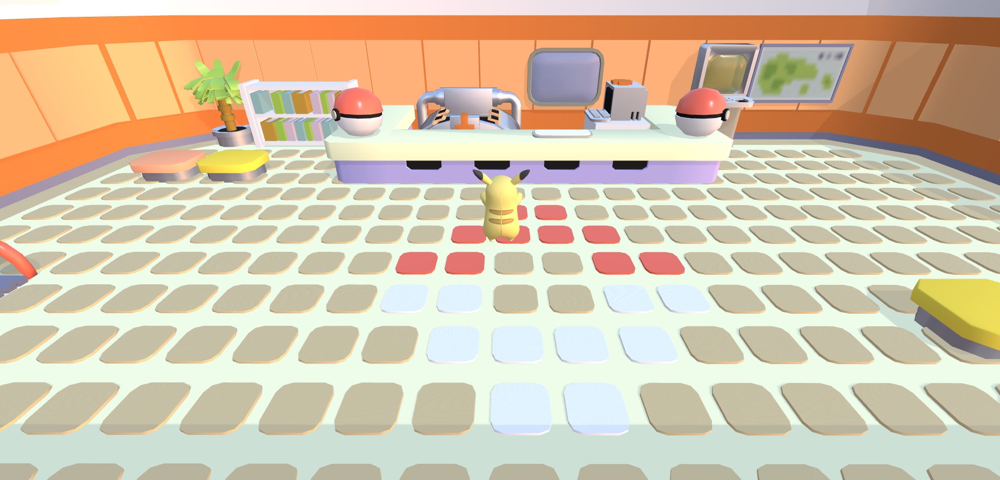

# Pokémon Center 3D


## Description

Explore a 3D Pokemon Center and view a Pokedex with interactive elements using Three.js and React. Walk around the Pokemon Center and discover your favorite Pokemon in an immersive 3D environment.

## Features

- **3D Navigation**: Walk around a 3D Pokemon Center.
- **Pokedex**: Access a list of Pokemon and view details for each one.
- **Interactive Camera**: Orbit, zoom, and pan the camera to explore the environment.

## Screenshots




## Getting Started

### Prerequisites

Make sure you have the following installed:

- [Node.js](https://nodejs.org/) (>= 14.x)
- [npm](https://www.npmjs.com/) (>= 6.x)

### Installation

1. Clone the repository:

   ```bash
   git clone https://github.com/benjii66/pokemon-center.git
   cd pokemon-center
   ```

2. Install dependencies:
   ```bash
   npm install
   ```
3. Start the development server:
   ```bash
   npm start
   ```

## Usage

- Use the 'W', 'A', 'S', 'D' keys to move around (or 'Z', 'Q', 'S', 'D' for AZERTY keyboards)
- Use the mouse left-click to orbit and zoom the camera

## Project Structure

```bash
POKEMON-CENTER/
├── node_modules/
├── public/
│   ├── assets/
│   ├── models/
│   │   ├── Pikachu/
│   │   │   ├── animations/
│   │   │   ├── source/
│   │   │   │   ├── images/
│   │   │   │   │   ├── pikachu.glb
│   │   │   │   │   ├── PikachuM.FBX
│   │   │   │   │   └── PikachuM.gltf
│   │   ├── textures/
│   │   ├── pokecenter/
│   │   │   └── pokemon_center_emerald.glb
│   ├── favicon.ico
│   ├── index.html
│   ├── logo192.png
│   ├── logo512.png
│   ├── manifest.json
│   └── robots.txt
├── src/
│   ├── components/
│   │   ├── credit.js
│   │   ├── Pikachu.js
│   │   ├── PokemonCenter_shadow.js
│   │   └── PokemonCenter.js
│   ├── App.css
│   ├── App.js
│   ├── App.test.js
│   ├── index.css
│   ├── index.js
│   ├── logo.svg
│   ├── reportWebVitals.js
│   └── setupTests.js
├── .gitattributes
├── .gitignore
├── license.md
├── package-lock.json
└── package.json
```

## TODO

- [ ] **Add collision detection**: Prevent the character from passing through furniture and walls.
- [ ] **Add animations**: Implement walking, running, and idle animations for the character.
- [ ] **Add interaction with objects**: Enable interaction with objects such as opening a Pokedex.
- [ ] **Expand the environment**: Add more rooms and areas to explore.
- [ ] **Enhance lighting and shadows**: Improve the lighting for a more realistic look.
- [ ] **Optimize performance**: Ensure smooth performance across different devices.

### Detailed TODO List

- **Add collision detection**

  - Implement collision detection to prevent the character from walking through walls and furniture.
  - Ensure smooth navigation around obstacles.

- **Add animations**

  - Integrate character animations such as walking, touch, and idle states.
  - Use animation blending for smoother transitions.

- **Add interaction with objects**

  - Enable character interaction with objects (e.g., open a Pokedex, sit on chairs).
  - Create a user interface for interactive objects.

- **Optimize performance**
  - Optimize 3D models and textures for better performance.
  - Ensure smooth gameplay with keyboard and controller (why not mobile ?).

## Contributing

Contributions are welcome! Please follow these steps:

1. Fork the repository.
2. Create a new branch (`git checkout -b feature/your-feature`).
3. Commit your changes (`git commit -m 'Add some feature'`).
4. Push to the branch (`git push origin feature/your-feature`).
5. Open a Pull Request.

## Licence

This project is licensed under the MIT License - see the License file for details

## Acknowledgements

- Model by [Alberto Luviano](https://sketchfab.com/AlbertoLuviano) - [License](https://creativecommons.org/licenses/by-sa/4.0/)
- Built with [Three.js](https://threejs.org/) and [React](https://react.dev/)

## Contact

- Github: [benjii66](https://github.com/benjii66)
- LinkedIn: [benjaminS](www.linkedin.com/in/benjamiinsimon)
